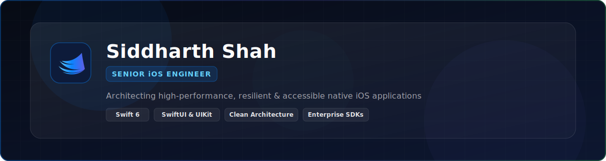

<p align="center">
  
</p>

<p align="center">
  
</p>

<p align="center">
  <a href="https://github.com/sidshah13">
    
  </a>
  <a href="https://github.com/sidshah13?tab=followers">
    
  </a>
  <a href="https://github.com/sidshah13">
    
  </a>
  
</p>

<p align="center">
  
</p>

## 📌 Professional Summary

Senior iOS Engineer with **7+ years** of experience engineering scalable, resilient, and accessible mobile applications. Specialized in Swift, Objective-C, SwiftUI, and UIKit within Clean Architecture and modular SDK ecosystems. Proven track record of delivering enterprise-grade mobile products focused on high performance, offline-first reliability, robust authentication, and long-term code maintainability.

---

## 🔭 About Me

- **Current Work:** Architecting native iOS applications with Swift 6 and modern concurrency models.
- **Learning:** On-device AI integration with Apple Intelligence, visionOS spatial UI patterns, and Swift compiler optimizations.
- **Ask Me About:** Clean Architecture (VIP/MVVM), reusable iOS SDK design, OAuth/JWT authentication flows, and performance profiling.
- **Engineering Philosophy:** Keep public surfaces minimal, make dependencies explicit, and design systems for seamless long-term evolution.
- **Goals:** Building zero-dependency iOS frameworks and high-throughput enterprise mobile applications.
- **Contact:** [Email](mailto:siddharthshah199@gmail.com) · [GitHub](https://github.com/sidshah13) · [Solo.to](https://solo.to/sidsha13)

---

## 💡 Engineering Principles

> *"Build for the engineer who has to extend the codebase next, not just for the user who opens the app today."*

- **Small Surface Area** — Minimize public APIs and restrict module scope to enforce loose coupling.
- **Explicit Dependencies** — Inject dependencies explicitly via protocols to eliminate hidden singletons and side effects.
- **Performance First** — Target 60+ FPS UI rendering, zero memory leaks, and optimal background task execution.
- **Accessibility by Design** — Native support for VoiceOver, Dynamic Type, and inclusive UI interactions.
- **Testability by Default** — Architect features around isolated domain boundaries to enable fast, reliable XCTest suites.
- **Long-Term Evolution** — Write self-documenting, maintainable code structured for iterative business changes.

---

## 🛠️ Tech Stack

### 🍏 Apple Platforms & UI
[](https://swift.org)
[](https://developer.apple.com/documentation/uikit)
[](https://developer.apple.com/xcode/swiftui/)
[](https://developer.apple.com/documentation/objectivec)
[](https://developer.apple.com/accessibility/)

### 🏗️ Architecture & Design Patterns
[](https://clean-swift.com)
[](https://en.wikipedia.org/wiki/Model%E2%80%93view%E2%80%93viewmodel)
[](https://en.wikipedia.org/wiki/Modular_programming)
[](https://en.wikipedia.org/wiki/Offline-first)

### 🌐 Networking, Cloud & Auth
[](https://restfulapi.net)
[](https://oauth.net)
[](https://jwt.io)
[](https://firebase.google.com)

### 🧪 Testing, DevOps & CI/CD
[](https://developer.apple.com/documentation/xctest)
[](https://fastlane.tools)
[](https://github.com/features/actions)

### 💾 Storage & Core Tools
[](https://developer.apple.com/documentation/coredata)
[](https://www.sqlite.org)
[](https://www.swift.org/package-manager/)
[](https://developer.apple.com/xcode/)

---

## 🚀 Featured Projects

> Selected public open-source implementations demonstrating native architecture, component modularity, and code stewardship.

### [Supertal-Practical](https://github.com/sidshah13/Supertal-Practical)
- **Description:** iOS production sample application loading user directory feeds via REST API with complete list/detail routing.
- **Technology:** Swift, Clean VIP Architecture, Alamofire, SDWebImage, Reachability, XCTest.
- **Architecture:** Clean VIP (View-Interactor-Presenter) with unidirectional data flow and protocol-driven contracts.
- **Key Highlights:** Fully unit-tested presentation logic, asynchronous image caching, and network status handling.

### [Grocery-App](https://github.com/sidshah13/Grocery-App)
- **Description:** Objective-C mobile grocery application highlighting legacy code maintenance and multi-contributor workflow.
- **Technology:** Objective-C, UIKit, Foundation, Core Graphics.
- **Key Highlights:** Demonstrates deep legacy iOS stewardship, Objective-C dynamic runtime handling, and long-term project evolution.

### [GooglePlaceAutoCompleteDemo](https://github.com/sidshah13/GooglePlaceAutoCompleteDemo)
- **Description:** Reusable Swift iOS integration pattern for Google Places AutoComplete SDK.
- **Technology:** Swift, UIKit, Google Places SDK, Location Services.
- **Key Highlights:** Decoupled search interface, throttling search inputs to minimize API consumption, clean delegate pattern.

### [SampleScroll](https://github.com/sidshah13/SampleScroll)
- **Description:** Native iOS scroll view performance demonstration.
- **Technology:** Swift, UIKit, `UIScrollView`, Auto Layout.
- **Key Highlights:** Optimized layout calculations and dynamic content resizing for smooth 60 FPS scrolling performance.

---

## 💼 Enterprise & Professional Experience

> Enterprise iOS software built for commercial clients is protected under Non-Disclosure Agreements (NDAs). Below is an overview of verified technical domains delivered in production:

- **Enterprise Mobile Applications** — Engineered multi-module iOS applications serving large user bases with high uptime requirements.
- **SDK & Component Development** — Created reusable internal Swift frameworks for authentication, networking, and UI design systems.
- **Authentication & Security** — Implemented OAuth 2.0 PKCE auth flows, JWT token lifecycle management, Keychain encryption, and Certificate Pinning.
- **Offline-First Storage & Sync** — Designed resilient offline storage layers using Core Data and SQLite with background delta sync algorithms.
- **Real-Time Communication** — Built WebSocket messaging modules for low-latency live events and real-time status updates.
- **Performance Optimization** — Conducted memory profiling (Instruments), eliminated retain cycles, reduced launch times, and achieved 60+ FPS UI rendering.
- **Accessibility Compliance** — Audited and implemented full VoiceOver traits, accessible touch targets, and Dynamic Type scaling.

---

## 🗓️ Career Timeline

```
┌───────────────────────────────────────────────────────────────────────────┐
│ 2015 – 2019  │ Foundational iOS Engineering                              │
│              │ Objective-C, early Swift migration, UIKit & Core Graphics │
├──────────────┼───────────────────────────────────────────────────────────┤
│ 2019 – 2023  │ Senior Native iOS Development                             │
│              │ Clean Architecture (VIP/MVVM), Enterprise Apps, Auth SDKs │
├──────────────┼───────────────────────────────────────────────────────────┤
│ 2023 – 2026  │ Modern Architecture & Framework Design                   │
│              │ SwiftUI adoption, Swift 6 Concurrency, SPM modularization │
├──────────────┼───────────────────────────────────────────────────────────┤
│ 2026+        │ Spatial Computing & Advanced Systems                      │
│              │ visionOS, Apple Intelligence APIs, zero-dependency SDKs  │
└───────────────────────────────────────────────────────────────────────────┘
```

---

## 🎯 Current Focus

- 🧱 **Currently Building:** High-performance, zero-dependency iOS frameworks using Swift 6 strict concurrency checks.
- 📖 **Current Learning:** Apple Intelligence Foundation Models, Spatial UI design paradigms for visionOS, and async algorithms.
- 🔭 **Future Interests:** Developer tooling, Swift compiler plugins, and low-latency audio/video rendering engines.

---

## 🔓 Open Source Interests

- ⚡ **Swift Ecosystem:** Contributing to SPM packages and modular architecture documentation.
- ♿ **Accessibility:** Developing lightweight diagnostic tools to verify VoiceOver attributes in UIKit and SwiftUI views.
- 🛠️ **Developer Tooling:** Creating Swift build-time scripts to catch retain cycles and memory leaks early.

---

## ⚡ Recent Activity

<!--START_SECTION:activity-->
<!--END_SECTION:activity-->

---

## 📊 GitHub Analytics

<p align="center">
  
  
</p>

<p align="center">
  
</p>

<p align="center">
  <picture>
    <source media="(prefers-color-scheme: dark)" srcset="assets/github-contribution-grid-snake-dark.svg" />
    <source media="(prefers-color-scheme: light)" srcset="assets/github-contribution-grid-snake.svg" />
    
  </picture>
</p>

---

## 📫 Connect & Contact

<p align="center">
  <a href="https://github.com/sidshah13">
    
  </a>
  <a href="mailto:siddharthshah199@gmail.com">
    
  </a>
  <a href="https://solo.to/sidsha13">
    
  </a>
</p>

<p align="center">
  <sub>Built with precision, truthfulness &amp; continuous evolution. Designed in Apple dark glassmorphic aesthetic.</sub>
</p>