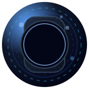
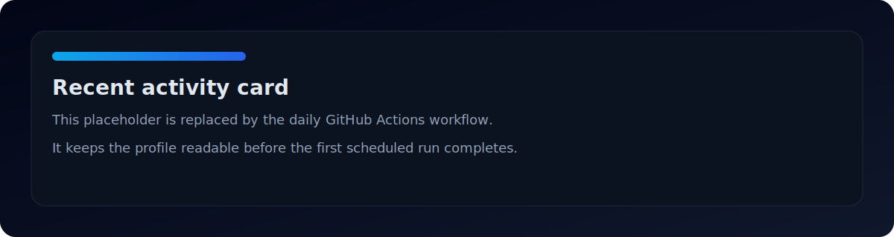

# Siddharth Shah

  

  

  
  
  

  <strong>Senior iOS Engineer</strong> with <strong>10+ years</strong> of experience building polished mobile experiences with Swift, Objective-C, UIKit, SwiftUI, and clean architecture.

## Professional Summary

I build iOS software the way senior teams need it built: modular, testable, readable, and ready to evolve. My public work centers on Swift and Objective-C app development, API-driven user flows, reusable UI components, and architecture-first implementation patterns. I care about shipping products that are secure, maintainable, and pleasant to extend rather than clever code that only works in the moment.

## About Me

- **Current focus:** Swift 6, Apple Intelligence, VisionOS, and AI-powered mobile experiences.
- **Engineering philosophy:** keep the surface area small, make dependencies explicit, and optimize for long-term change.
- **What I enjoy building:** enterprise mobile apps, real-time experiences, secure authentication flows, and reusable SDKs.
- **Career highlights:** shipped Swift and Objective-C codebases, worked with Clean VIP and MVVM patterns, and built projects with test targets and reusable UI layers.

## Tech Stack

### Languages

### Mobile

### Architecture

### Cloud

### Backend

### Testing

### CI/CD

### Tools

### Databases

### SDKs

## Engineering Skills

| Area | Strength | Evidence |
| --- | --- | --- |
| Swift and UIKit | Core iOS implementation skills with modern and legacy codebases | Multiple Swift projects and UIKit-era repositories |
| Objective-C maintenance | Comfortable working in older production code | Grocery-App, FlatUIKit, and other Objective-C libraries |
| Architecture | Preference for Clean VIP, MVVM, and modular boundaries | Supertal-Practical and SwiftFonts documentation |
| Networking and API flows | Strong API-driven mobile app experience | Supertal-Practical uses mockapi.io with Alamofire |
| Testability | Repo structure includes XCTest targets and UI tests | Supertal-PracticalTests and UITests folders |
| Reusable SDKs and components | Repeated focus on reusable UI and utility libraries | Public repos and fork history around iOS components |
| Legacy code stewardship | Willingness to maintain and modernize older projects | Objective-C and older Swift repository history |

## Featured Projects

I keep this list intentionally short because most of the public repository surface is made up of historical forks, mirrors, and small experiments.

### Supertal-Practical

- **Repository:** [sidshah13/Supertal-Practical](https://github.com/sidshah13/Supertal-Practical)
- **Description:** A Swift iOS interview project that loads users from mockapi.io and shows a list/detail flow.
- **Technology:** Swift, Alamofire, ReachabilitySwift, SDWebImage, CocoaPods, XCTest.
- **Architecture:** Clean VIP.
- **Highlights:** API-driven user list, detail screen, loading state, and test targets.

### Grocery-App

- **Repository:** [sidshah13/Grocery-App](https://github.com/sidshah13/Grocery-App)
- **Description:** Legacy Objective-C grocery application with multiple contributors and a small Jekyll repo scaffold.
- **Technology:** Objective-C, Ruby/Jekyll metadata.
- **Architecture:** Not publicly documented in the repository, but clearly an older UIKit-era iOS codebase.
- **Highlights:** Multi-contributor history, real app structure, and proof of long-term Objective-C maintenance.

## Private Repository References

I also have private repository work that is not linked here because it is not public. If you want to highlight private experience on the profile, I can add sanitized references such as:

- Enterprise mobile apps
- Real-time messaging
- Secure authentication and session handling
- Internal SDKs and reusable components
- Performance optimization and offline-first work

If you want, I can also turn this into a short NDA-safe private-work section with specific repo names you provide.

## GitHub Analytics

Private contributions can appear in GitHub's contribution count if your profile setting includes them. That lets the public profile show a fuller activity picture without exposing private repository names.

  
  

  
  

  

  

  
  

  

  <picture>
    <source media="(prefers-color-scheme: dark)" srcset="assets/github-contribution-grid-snake-dark.svg" />
    <source media="(prefers-color-scheme: light)" srcset="assets/github-contribution-grid-snake.svg" />
    
  </picture>

## Career Highlights

- **SDK development:** Your public history includes reusable components, auth-related libraries, and SDK-style projects.
- **Architecture:** Clean VIP, MVVM, and modular thinking show up in the repos that are documented well enough to inspect.
- **Authentication:** OAuth-related work appears in the public footprint through `socialauth-android` and `OAuthSwift`.
- **Performance-sensitive UI:** Your repo history is full of scrolling, transitions, loaders, and image caching libraries.
- **Testing:** `Supertal-Practical` includes both unit and UI test targets.
- **Legacy stewardship:** Public Objective-C code shows that you can maintain and work inside older mobile stacks without losing product quality.

## Current Learning

- Swift 6
- Apple Intelligence
- VisionOS
- AI

## Connect

## Developer Philosophy

> Build for the engineer who has to extend it next, not only for the user who opens it today.

---

Minimal. Modern. Recruiter-friendly. Built around real public evidence.