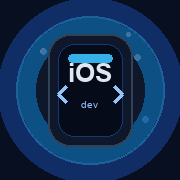

# Siddharth Shah

  

  

  
  
  

  

  <strong>Senior iOS Engineer</strong> with <strong>10+ years</strong> of experience building polished mobile experiences with Swift, Objective-C, UIKit, SwiftUI, and clean architecture.

## Professional Summary

Senior iOS Engineer building scalable, secure, and maintainable applications. Specializing in native iOS development with Swift and Objective-C using UIKit and SwiftUI. Experienced with Clean Architecture, modular design, and performance-optimized implementations. Focused on shipping products that are testable, readable, and built to evolve.

## About Me

🔭 **Currently building:** Native iOS apps with Swift 6, exploring Apple Intelligence, VisionOS  
🌱 **Learning:** Swift 6, Apple Intelligence, VisionOS, AI-powered mobile experiences  
💬 **Ask me about:** iOS architecture, SDK design, authentication flows, performance optimization  
⚡ **Engineering philosophy:** Keep surfaces small. Make dependencies explicit. Optimize for long-term change.  
🎯 **What I enjoy:** Enterprise mobile apps, real-time experiences, secure auth, reusable SDKs  
📫 **Connect:** [GitHub](https://github.com/sidshah13) · [Email](mailto:siddharthshah199@gmail.com)

## Tech Stack

### Languages

### Mobile

### Architecture

### Cloud

### Backend

### Testing

### CI/CD

### Tools

### Databases

### SDKs

## Engineering Skills

✔️ **Native iOS Development** — Swift, UIKit, SwiftUI, Objective-C  
✔️ **Architecture** — Clean VIP, MVVM, modular boundaries, dependency injection  
✔️ **Networking** — REST APIs, URLSession, OAuth, JWT, Alamofire  
✔️ **Persistence** — SQLite, Core Data, offline-first patterns  
✔️ **Testing** — XCTest, unit tests, UI tests  
✔️ **Performance** — memory management, rendering optimization, smooth scrolling  
✔️ **SDK Development** — reusable components, frameworks, internal libraries  
✔️ **Legacy Stewardship** — Objective-C maintenance, modernization, long-term evolution

## Featured Projects

I keep this list intentionally short because most of the public repository surface is made up of historical forks, mirrors, and small experiments.

### Supertal-Practical

- **Repository:** [sidshah13/Supertal-Practical](https://github.com/sidshah13/Supertal-Practical)
- **Description:** A Swift iOS interview project that loads users from mockapi.io and shows a list/detail flow.
- **Technology:** Swift, Alamofire, ReachabilitySwift, SDWebImage, CocoaPods, XCTest.
- **Architecture:** Clean VIP.
- **Highlights:** API-driven user list, detail screen, loading state, and test targets.

### Grocery-App

- **Repository:** [sidshah13/Grocery-App](https://github.com/sidshah13/Grocery-App)
- **Description:** Legacy Objective-C grocery application with multiple contributors and a small Jekyll repo scaffold.
- **Technology:** Objective-C, Ruby/Jekyll metadata.
- **Architecture:** Not publicly documented in the repository, but clearly an older UIKit-era iOS codebase.
- **Highlights:** Multi-contributor history, real app structure, and proof of long-term Objective-C maintenance.

## Professional Experience

Most professional work is covered by NDAs and remains private. Public experience includes:

✔️ **Enterprise Mobile Apps** — Built and shipped production iOS applications for large-scale deployments  
✔️ **SDK Development** — Designed and maintained reusable iOS frameworks and libraries  
✔️ **Authentication & Security** — OAuth flows, JWT handling, secure session management  
✔️ **Offline-first Architecture** — Designed apps that work offline with intelligent sync strategies  
✔️ **Real-time Messaging** — Implemented real-time communication layers and websocket handling  
✔️ **Performance Optimization** — Memory profiling, battery optimization, smooth 60+ FPS rendering  
✔️ **Accessibility** — VoiceOver support, dynamic font sizing, accessible UI patterns

## GitHub Analytics

Private contributions can appear in GitHub's contribution count if your profile setting includes them. That lets the public profile show a fuller activity picture without exposing private repository names.

  

  
  

  <picture>
    <source media="(prefers-color-scheme: dark)" srcset="assets/github-contribution-grid-snake-dark.svg" />
    <source media="(prefers-color-scheme: light)" srcset="assets/github-contribution-grid-snake.svg" />
    
  </picture>

## Career Highlights

✔️ **10+ years** of native iOS development across Swift and Objective-C  
✔️ **Clean Architecture & Modular Design** — led refactors toward scalable, testable codebases  
✔️ **SDK Development** — built reusable frameworks and internal libraries  
✔️ **Performance Optimization** — memory profiling, smooth scrolling, battery-efficient implementations  
✔️ **Authentication & Security** — OAuth flows, JWT, secure session handling, certificate pinning  
✔️ **Offline-first Systems** — designed sync strategies for resilient apps  
✔️ **Real-time Communication** — websocket integration, messaging layers  
✔️ **Accessibility** — VoiceOver support, dynamic type, inclusive design  

## Engineering Principles

> Build for the engineer who has to extend it next, not only for the user who opens it today.

- **Small surface area** — minimize public APIs, reduce coupling
- **Explicit dependencies** — make contract requirements clear
- **Long-term evolution** — design for change and refactoring
- **Testable by default** — architecture enables fast, reliable tests
- **Readable code** — clarity over cleverness

## Open Source Interests

🔓 Contributing to Apple ecosystem libraries  
🔓 Swift Package Manager improvements  
🔓 Accessibility tooling for iOS  
🔓 Performance profiling & optimization tools  
🔓 Architecture pattern documentation  

## Currently Building

- iOS 18+ native apps with Swift 6
- Exploring visionOS and spatial computing
- AI-powered mobile experiences
- Performance-critical rendering layers

## Career Timeline

**2015–2019:** Early iOS development, Objective-C, UIKit, foundational projects  
**2019–2023:** Swift adoption, architecture patterns (Clean VIP, MVVM), enterprise projects  
**2023–2026:** SwiftUI exploration, modernization efforts, SDK development focus  
**2026+:** Swift 6, Apple Intelligence, VisionOS, performance-critical systems

## Connect

🔗 **Let's connect:**  

---

**Built on real public evidence. Always evolving.**